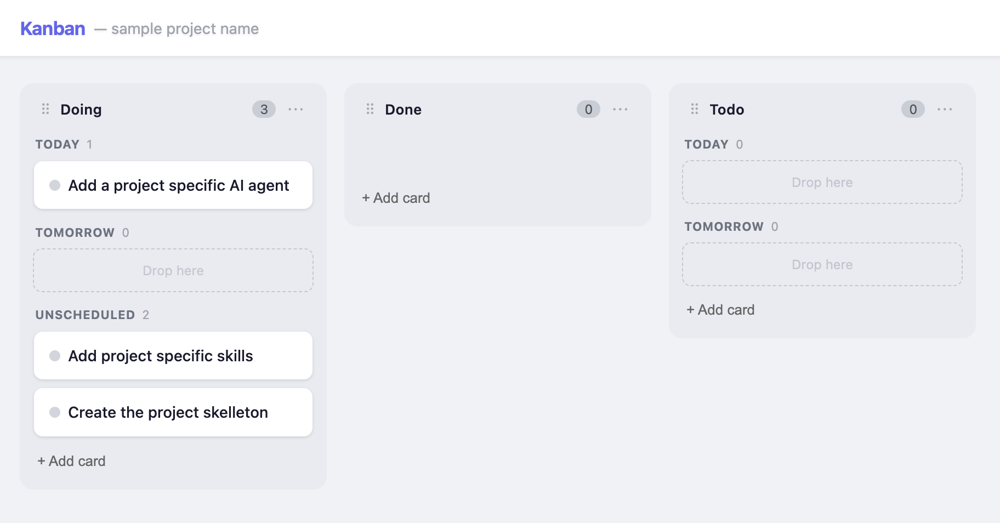

# Kanban

A local-first kanban board for developers. Cards live as plain `.md` files inside your project — edit them in your IDE, move them on the board, or let an AI assistant write them directly.



```
your-project/
└── .kanban/
    ├── todo/
    │   └── fix-login-bug.md
    ├── doing/
    │   └── refactor-auth.md
    └── done/
        └── ship-v1.md
```

## How it works

Run `kanban` inside any project. It starts a local web server, opens a board in your browser, and watches `.kanban/` for changes. Every card is a Markdown file with YAML frontmatter — the folder it lives in is its status.

Because cards are just files, they:
- Travel with your repo (commit `.kanban/` to git)
- Work with any editor — open the `.md` and edit it directly
- Work with AI assistants — ask Claude or Copilot to create or update tasks by writing files

## Installation

**Requirements:** Node.js ≥ 18, pnpm

```bash
git clone https://github.com/your-org/kanban.git
cd kanban
pnpm install
pnpm build
```

Then link the CLI globally:

```bash
# First-time only: add pnpm's global bin dir to your PATH
pnpm setup   # restart your shell after this if it's your first time

# Link the CLI (must run from inside the server package)
cd packages/server
pnpm link --global
```

Alternatively, install globally with npm:

```bash
npm install -g ./packages/server
```

Or skip global install entirely and run it directly:

```bash
node ./packages/server/dist/cli.js
```

## Usage

Navigate to any project directory and run:

```bash
cd your-project
kanban
```

The board opens at `http://localhost:3131`. On first run, it creates a `.kanban/` directory with three default columns: `todo`, `doing`, and `done`.

### Options

```bash
kanban --port=4000   # use a custom port (default: 3131)
```

### Creating cards

**From the board** — click "+ Add card" at the bottom of any column and enter a title.

**From your IDE** — create a `.md` file in the appropriate column folder:

```markdown
---
id: my-new-task
title: My new task
created: 2026-05-27T10:00:00Z
updated: 2026-05-27T10:00:00Z
tags: [backend, bug]
priority: high
assignee: me
---

Describe the task here. Full **Markdown** is supported.

- [ ] Step one
- [ ] Step two
```

The board updates live as soon as you save.

**From an AI assistant** — ask Claude (or any AI with file access) to create a task:

> "Create a kanban card in `.kanban/todo/` for improving error handling in the auth module"

### Moving cards

Drag a card between columns or within a column to reorder. You can also move a card by moving its file to a different column folder — the board will sync immediately.

### Editing cards

Click any card to open the detail panel. You can edit the title and body there, or open the `.md` file directly in your editor.

### Deleting cards

Open a card's detail panel and click **Delete**, or delete the `.md` file from your filesystem.

### Columns

Columns are auto-discovered from subdirectories of `.kanban/`. To add a new column, create a folder:

```bash
mkdir .kanban/review
```

It appears on the board immediately. Columns are displayed in alphabetical order.

### Day-grouping

Columns can divide their cards into per-day groups. By default:

- **todo** groups by a `scheduled` date — `Overdue`, `Today`, `Tomorrow`, future days, and `Unscheduled`. Drag a card onto a day section, or set the date in the card detail panel, to plan when you'll work it.
- **done** groups by a `completed` date (stamped automatically when a card is moved into Done) — `Today`, `Yesterday`, then earlier days, so you can review what you finished each day.

Change a column's grouping from the `⋯` menu on its header, or edit `.kanban/config.json`:

```json
{
  "columns": {
    "todo": { "groupBy": "scheduled" },
    "done": { "groupBy": "completed" }
  }
}
```

`groupBy` is one of `"none"`, `"scheduled"`, or `"completed"`. Cards roll between Today/Tomorrow/Yesterday automatically as days pass.

## Card format

Each card is a `.md` file. The filename stem (without `.md`) is the card's ID and must be unique across all columns.

```markdown
---
id: fix-login-bug          # required — must match filename
title: Fix login bug       # required
created: 2026-05-27T10:00:00Z
updated: 2026-05-27T11:30:00Z
tags: [bug, auth]
priority: high
assignee: me
scheduled: 2026-05-30        # optional — day you plan to work it (drives todo grouping)
completed: 2026-05-28        # optional — auto-stamped when moved into a done-grouped column
---

Free-form Markdown body. Supports checklists, code blocks, links, etc.
```

Only `id` and `title` are required. All other frontmatter fields are optional and are preserved on round-trip — the tool will never remove keys it doesn't recognise.

Card ordering within a column is stored in a `.order` file inside each column directory. This file is managed automatically; you don't need to edit it manually.

## Project structure

```
local-kanban/
├── packages/
│   ├── shared/                  # TypeScript types shared between server and web
│   │   └── src/
│   │       └── index.ts         # Card, Column, BoardState, WSMessage
│   │
│   ├── server/                  # Node.js backend + CLI
│   │   └── src/
│   │       ├── cli.ts           # Entry point — bootstraps .kanban/, starts server
│   │       ├── index.ts         # Express app + WebSocket server factory
│   │       ├── routes.ts        # REST API routes with Zod validation
│   │       ├── watcher.ts       # chokidar file watcher → WebSocket broadcast
│   │       ├── fs/
│   │       │   ├── board.ts     # All on-disk operations (read, write, move, delete)
│   │       │   └── board.test.ts
│   │       └── util/
│   │           └── nanoid.ts    # Tiny random ID generator
│   │
│   └── web/                     # React frontend
│       └── src/
│           ├── App.tsx
│           ├── api.ts           # Typed fetch wrappers for the REST API
│           ├── hooks/
│           │   └── useBoardSocket.ts   # WebSocket hook with auto-reconnect
│           └── components/
│               ├── Board.tsx    # DnD context, drag logic, optimistic updates
│               ├── Column.tsx   # Droppable column with sortable cards
│               ├── CardItem.tsx # Draggable card chip
│               └── CardModal.tsx # Card detail / edit panel
│
├── tsconfig.base.json
└── pnpm-workspace.yaml
```

## REST API

The server exposes a JSON API at `http://localhost:3131/api`:

| Method | Path | Description |
|--------|------|-------------|
| `GET` | `/api/board` | Full board state |
| `POST` | `/api/cards` | Create a card `{ column, title, body? }` |
| `PATCH` | `/api/cards/:id` | Update a card `{ title?, body?, frontmatter? }` |
| `POST` | `/api/cards/:id/move` | Move a card `{ column, index }` |
| `DELETE` | `/api/cards/:id` | Delete a card |

A WebSocket connection at `ws://localhost:3131` receives `board:update` events whenever the board changes (from the UI or from file edits).

## Development

```bash
# Terminal 1 — web dev server with HMR (proxies /api and /ws to :3131)
pnpm --filter @kanban/web dev

# Terminal 2 — server with live reload, watching your project
cd /your/project
node --import tsx/esm /path/to/kanban/packages/server/src/cli.ts
```

### Tests

```bash
pnpm --filter @kanban/server test
```

Tests cover the filesystem layer against a real temporary directory: bootstrap, create, update, move across columns, reorder, delete, frontmatter round-trip, and path-traversal rejection.

## Committing your board to git

Add `.kanban/` to your repository so tasks travel with the code:

```bash
git add .kanban/
git commit -m "add kanban board"
```

Add `*.order` to `.gitignore` if you don't want to track card ordering, though keeping it is usually useful for teams.
